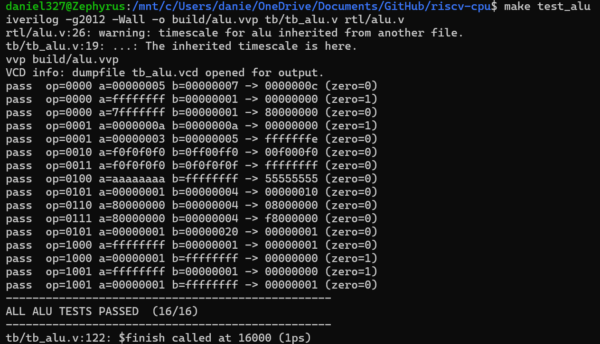
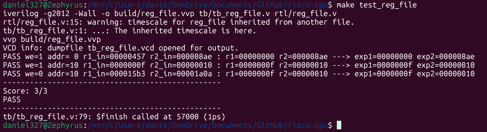
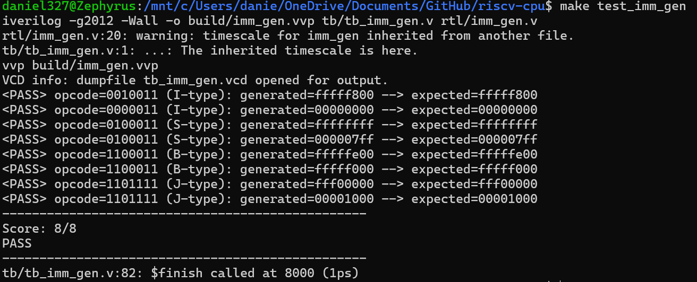

# Progress log

>  Day 1 - 2026-07-25 

## Done 
- Finished building the Arithmetic Logic Unit or ALU in short (`alu.v`). Tsted with a dedicated testbench file (`tb_alu.v`), all 16 test passed. Wrote combinational case for all 10 alu ops; learned signed shifts + b[4:0] slicing. 
- Learned about how to write a testbench, element such as time delay (#1), $display format, $random, etc. (`tb_alu.v`)
- Sidenote: spent like 1 hour fighting a nasty two copies of the repo bug (OneDrive vs Desktop).
- Completed register portion (`reg_file.v`), basic application of sequential circuit knowledge from digital circuit course, aka ECE124.

*ALU Passing*

## Doing 
- Working on testbench for register, (`tb_reg_file.v`), learning how to generate a periodic clock signal to test it since it contains synchronous logic. 

> Day 2 - 2026-07-26

## Done
- Finished building register file testbench (`tb_reg_file.v`)
- Learned how to build a testbench when synrchronous block is involved, such as time delay, how to generate a clock signal. Also, how to build a check function to check different cases, display results, use of system task and functions. The cases are not random, coming up cases that covers lots of scenarios, like what happen when your read address is 0 but enable is 1, in RISC-V, address 0 register always store the value 0, easier for doing arithmetic with 0.

*REG_FILE Passing*

## Doing
- Moving on to imm_gen (`imm_gen.v`)

> Day 3 - 2026-07-27

## Done
- Done building immediate generation file (`imm_gen.v`)
- Basically learned what does a instruction contains, and that the last 7 bits is reserved for op-code that tells the system what type of operations it is. For example I-type needs 2 source register address, 1 destination register address, a 12 bit immediate and a predetermined 7 bits op-code used conventionally for RISc-V.
- Also understood why the immediate is often scrambled in the instruction, because different operations requires different amount of source register address and maybe doesn't need a destination, writing into the memory instead. So the point of the immediate generation is to pull the scrambled immediate in an instruction and piece the numbers back together.
- Understood the logic behind the testbench for this module (`tb_imm_gen.v`), plan to use contactenation to work backwards for coming up with expected values to check, that way I don't have to disect a random 32 bits instruction every single time.

## Doing
- Working on testbench (`tb_imm_gen.v`), have the logic in mind but just need some time to implement it in Verilog.

> Day 4 - 2026-07-28

## Done
- Completed immediate generation testbench (`tb_imm_gen.v`), hardest part was really coming with expected value for tests. 
- Getting more familiar with the testbench format, and also better some of my understanding of the when to use wire and reg, as well as how strings are treated in Verilog, kind of annoying because Icarus doesn't really compile when you have a wide string as inputs for task, which is why it took me so long to get it to run.
- Just tested a few cases for each operation type, like the sign bit extending and basic un-scrambelling of the immediate from the instruction bits.
- Also understand why it's B-type and J-type has different immediate structure comparing other type like I and S. 

*IMM_GEN Passing*

## Doing
- Moving on to control unit (`control.v`), which reads the opcode and produce all datapath control signals from all the module I've built so far. 
- Before implementing that I will fill in the `control_signals.md` just to organize my thinking and wiring. 

> Day 5 - 2026-07-29

## Done
- Completed control signal table (`control_signal.md`).
- Understood function of different instruction type, and what component they require to work.

## Doing
- Will move on to control unit (`control.v`) next time I work on this. 

